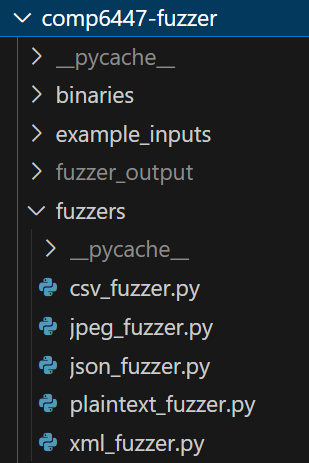

# The Fuzziest Fuzzer:

The fuzzer project aims to develop a robust and efficient fuzzing tool for testing software applications. Each component of the Fuzzer has been dissected into numerous components and generalised to make usage easier.

## Group Name: FuzzyCactuses
## Group Members (zID)
* z5308790
* z5438916
* z5384080
* z5310067

## The fuzzer classes:

- Each fuzzer is split up into different classes based on the file type
- Called in a folder that is `./fuzzers` from the root of the project
- All of them follow an equivalent structure:
```python
def pattern(self, 
    attribute1: type, 
    attribute2: type
) -> str:
        # code that uses the attributes to randomise the structure of the payload
    #...
    return input_pattern
def mutation_parameters(self, 
    mutate_attribute1: bool, 
    mutate_attribute2: bool
) -> list:
    if mutate_attribute1:
        attrbiute1 = random... # some form of randomisation
    else:
        attrbiute1 = default... # a value representing standard behaviour
    #...
    mutation_dict = {
        "attribute1": attribute1,
        "attribute2": attribute2
    }
    return self.pattern(attribute1, attribute2), mutation_dict
```
- The `pattern` function itself determines the structure of the payload and what parts of it get randomised. This is custom defined for each file type as each one has a different structure.
- The `mutation_parameters` function is called by the main function to determine if a field is randomised or kept as a standard field. This allows the fuzzer to blend abnormal and normal behaviour between parameters, allowing for more specifics based on what bugs are caused by.

### Implementation:
```python
    for i in range (1, num_tests):
        if "csv" in bin_name:
            if i == 1:
                with open(f"fuzzer_output/bad_{bin_name}.txt", "w+") as file:
                    pass
            patterns_list = csv_fuzzer.mutation_parameters(
                random.choice([True, False]),
                random.choice([True, False]),
                random.choice([True, False]),
                random.choice([True, False]),
                random.choice([True, False])
            )
        payload = patterns_list[0]
        mutation_type = patterns_list[1]
```
- The mutation parameters are called like this, with the fuzzer choosing between true and false randomly
- The code then uses this to construct the pattern input that is passed into the binary being exploited.
### CSV fuzzer:
```python
def pattern(self, 

    header: list, 
    num_rows: int, 
    num_cols: int, 
    value_type: str, 
    cell_val_len: int

) -> str:
    # ...
def mutation_parameters(self, 

    mutate_header: bool, 
    mutate_num_rows: bool, 
    mutate_num_cols: bool, 
    mutate_value_type: bool, 
    mutate_cell_val_len: bool, 
    value_type: str = random.choice([
        "str", "int", "float", "hex", "bin", "mix"
    ])

) -> list:
    # ...
```
- This pattern randomises the number of rows, number of columns, whether the header is kept static or not, the types of values inputted and the amount of characters per cell
    - The types of values could be strings, integers, hexadecimal, etc. There is also an option that blends all of the value types together into the one input
    - Which type is chosen is completely random unless otherwise specified in the `value_type` field.

### JSON Fuzzer:
```python
def pattern(self, 

    header: list, 
    num_rows: int, 
    num_cols: int, 
    value_type: str, 
    cell_val_len: int

) -> str:
    # ...
def mutation_parameters(self,
        empty_or_nonjson:bool, 
        large_num: bool,
        large_input:bool, 
        random_structure: bool,  
        invalid_chars: bool,
        fstring:bool,
        extra_data_size: bool = False
) -> list:
    # ...
```
- This pattern can determine if the payload is empty/non-json, a large number, large input, whether to put in a random structure, invalid charcters, the frstring and the amount of data points in the more data section of the JSON.
- The process is similar to the CSV fuzzer

### Running the Fuzzer:
```python
for binary in binaries_list:
    binary_name = binary.replace('./binaries/', '')
    midpoint_list = ["csv1", "json1"]
    binary_input = './example_inputs/' + binary_name + '.txt' # Will need to change mutation function to accommodate example_input (for after midpoint?)
    for midpoint in midpoint_list:
        if midpoint in binary_name:
            print(f"\nRunning fuzzer against {binary_name}!\n")
            auto_test(binary_name, 100)
```
- When ran via the Dockerfile, the program will just run `main.py`, which will go through every binary specified (via the `midpoint_list` variable) and determine the correct filetype for each instance
- `main.py` defines functionality for manual testing, but at the moment just conducts automatic testing for each binary required.

### The output:
- The output will appear in stdout, displaying each instance of an error that causes the program to crash without defined behaviour. Each payload causing that crash will be logged under `bad_{name_of_binary}.txt`
- The tests are ran through gdb in order to get more detailed errors when an abnormal crash occurs.

## General Mutation Strategies
- **Bit/Byte Flipping**
The fuzzer performs bit or byte flipping by reading all the bytes of the input file and storing it in a bytearray. It then randomly selects a number (from 0 to the length of the bytearray) and replaces the byte at the chosen index with a random value from 0 to 255. In the case of bit flipping, since the bytearray values are in decimal value, the byte is converted it to a binary string and each binary digit of the string is stored in an array where one index of the array is changed to a 0 if it stores a 1 (and vice versa). Once the bit is flipped the array is concatenated into a string again and converted back to decimal form before replacing the original byte in the bytearray. 

This is done to create mutated inputs with unexpected behaviour that could potentially cause a valid crash. However, although this is can be performed up to a given amount of times, we decided to keep it at a low number of replacements since we want to keep the structure of the input and not have to run into invalid format errors which would prevent us from exposing vulnerabilities in the binary

- **Known Ints**
The fuzzer attempts to perform the known ints mutation strategy by parsing each line read through the input file and identifying every integer value using a regex search (isdigit() would not work as it does not account for negative values since '-' is considered a string value), and storing them in an array called input_integers. It would also work to just replace the integers on the spot, however we wanted to use random.sample() to generate a subset of all integers to replace, simulating the random number of replacements.

Once we have a subset of integers to replace we loop through the lines again and replace any found integers (through another regex) with one of the known ints provided. We provided a mix of small and large values to introduce unexpected behaviour, (for e.g. for programs where arithmetic is involved, providing INT_MAX could cause integer overflow issues leading to a potential buffer overflow attack).

It is not a perfect solution however, since the looping of the integer array introduces an issue where a part of a known int can be replaced with another known int (for example if our integers array is looking to replace a '1', and we already replaced an earlier integer with -2147483648, it would replace the 1 with another known int, leading to -2-3276847483648 occuring). An improvement that can be made is to improve the regex so that only exact matches are replaced.

- **Arithmetic Mutation**
The fuzzer performs arithmetic mutation in a similar manner to known ints, finding and storing integers to mutate using regex, except instead of replace the integer with a known integer, it will perform a calculation using one of the arithmetic lambda functions before replacing the integer. The lambda functions calculate a value by either adding, subtracting, multiplying or dividing the integer to be replaced with one random value from a list of given integers. Ideally, the list of random integers to perform arithmetic mutation with would contain large numbers INT_MAX to introduce integer overflow exploits, however testing showed it would often run into hanging issues. Since our fuzzer does not have the capability to detect hanging, we decided it was appropriate to remove them in order to not hurt our fuzzer running performance.